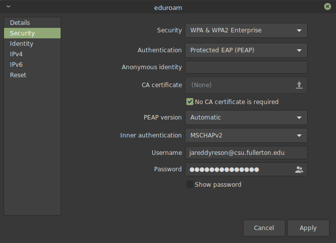

# CSUF WiFi Setup

## Arch Linux

First, please have `NetworkManager` installed.
This can be done using the following command:

```bash
sudo pacman -Sy --noconfirm networkmanager
```

Once that's done, proceed to the applet to create a new connection to `eduroam`

Make sure the configuration looks like this:



Then you're connected.

**Note:** NetworkManager stores its connection in the directory: `/etc/NetworkManager/system-connections/`

## Linux Mint

Follow [this link](http://wireless.fullerton.edu/eduroam/) to grab the WiFi wizard.
Click "CSUF Other", **not CSUF Student**.
For some reason the latter is broken.

Once that's done, change its permissions to execute and run it.
Provide the proper credentials and it will configure itself.

```bash 
chmod +x ~/Downloads/SecureW2_JoinNow.run
~/Downloads/SecureW2_JoinNow.run
```

